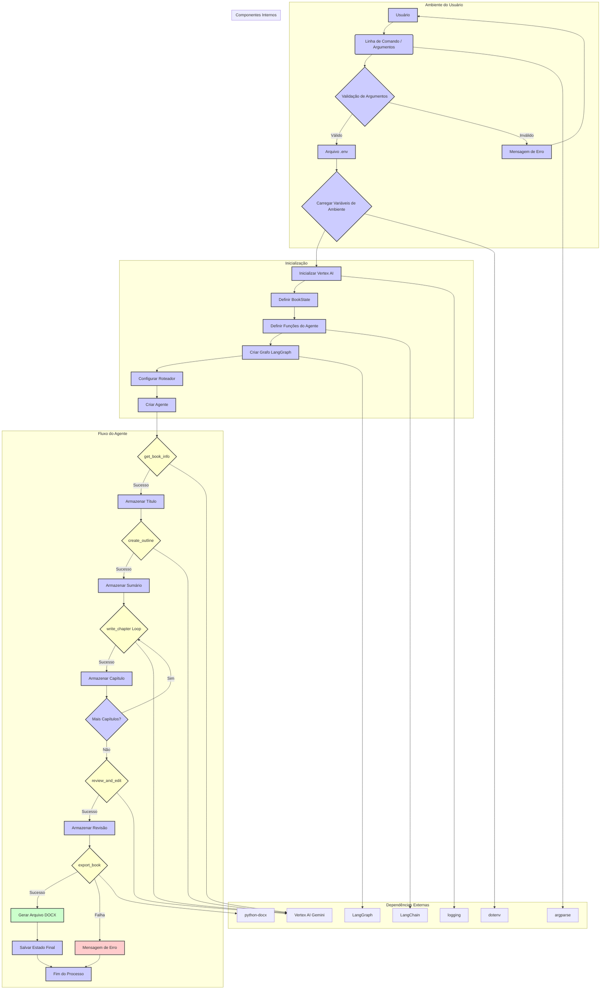

# Book Generation Agent with Gemini and LangGraph

Este projeto implementa um agente de geração de livros que utiliza o modelo Gemini do Google (via Vertex AI) e a biblioteca LangGraph para automatizar o processo de criação de um livro, desde a concepção da ideia até a exportação do conteúdo final em formato DOCX.

## Visão Geral

O agente de geração de livros é projetado para:

1.  **Coletar Informações Básicas:** Recebe um tema, gênero e público-alvo como entrada e gera um título adequado para o livro.
2.  **Criar Sumário:** Desenvolve um sumário detalhado, dividindo o livro em capítulos com títulos e descrições.
3.  **Escrever Capítulos:** Escreve o conteúdo de cada capítulo, mantendo a coerência com o tema, gênero e público-alvo definidos.
4.  **Revisar e Editar:** Fornece feedback sobre a estrutura e o conteúdo do livro, sugerindo melhorias.
5.  **Exportar:** Exporta o livro completo para um arquivo DOCX.

## Tecnologias Utilizadas

*   **Python:** Linguagem de programação principal.
*   **LangGraph:** Biblioteca para construção de grafos de estados, permitindo a criação de fluxos de trabalho complexos.
*   **Google Vertex AI:** Plataforma de IA do Google Cloud, utilizando o modelo Gemini para geração de texto.
*   **python-docx:** Biblioteca para manipulação de arquivos DOCX.
*   **dotenv:** Biblioteca para carregar variáveis de ambiente de um arquivo `.env`.
* **logging:** Biblioteca para geração de logs.
* **argparse:** Biblioteca para lidar com argumentos de linha de comando.

## Estrutura do Projeto

O projeto é composto por um único arquivo principal:

*   **`app.py`:** Contém toda a lógica do agente de geração de livros, incluindo:
    *   Inicialização do Vertex AI.
    *   Definição dos estados do grafo (classe `BookState`).
    *   Funções para cada etapa do processo (`get_book_info`, `create_outline`, `write_chapter`, `review_and_edit`, `export_book`).
    *   Função de roteamento (`router`) para determinar o próximo estado.
    *   Função para criar o agente (`create_book_agent`).
    *   Função principal (`main`) para executar o agente.
    *   Função para parsing seguro de JSON (`safe_json_parse`).
    *   Configuração de logs.

## Como Executar

### Pré-requisitos

1.  **Conta no Google Cloud:** É necessário ter uma conta no Google Cloud com o Vertex AI habilitado.
2.  **Chave de Serviço:** Configure uma chave de serviço para autenticação com o Vertex AI.
3.  **Variáveis de Ambiente:** Crie um arquivo `.env` na raiz do projeto com as seguintes variáveis:
    ```
    PROJECT_ID=seu-projeto-id
    LOCATION=us-central1 # ou a região de sua preferência
    ```
4.  **Instalação de Dependências:** Instale as dependências do projeto usando o `pip`:
    ```bash
    pip install -r requirements.txt
    ```
    O arquivo `requirements.txt` deve conter:
    ```
    python-dotenv
    langgraph
    google-cloud-aiplatform
    vertexai
    python-docx
    langchain
    ```

### Execução

Para executar o agente, utilize o seguinte comando:

```bash
python app.py --theme "Inteligência Artificial" --genre "Técnico" --audience "Profissionais de TI"
```

### Argumentos Opcionais:

* `--theme`: Define o tema do livro (ex: "Inteligência Artificial", "Desenvolvimento Web"). Se não for fornecido, um tema genérico será usado.

* `--genre`: Define o gênero do livro (ex: "Técnico", "Ficção Científica"). Se não for fornecido, o gênero "Ficção" será usado.

* `--audience`: Define o público-alvo do livro (ex: "Profissionais de TI", "Estudantes"). Se não for fornecido, o público "Adultos" será usado.

### Exemplo sem argumentos:

```bash
python app.py
```
Nesse caso, o agente usará os valores padrão para tema, gênero e público-alvo.

### Logs

O projeto gera logs detalhados em um arquivo chamado `book_generation`.log e também exibe logs no console. Isso ajuda a acompanhar o progresso do agente e a identificar possíveis erros.

### Fluxo de Trabalho

O fluxo de trabalho do agente é definido pelo grafo de estados do LangGraph. As etapas são:

1. `get_book_info`: Coleta informações básicas e gera o título.
2. `create_outline`: Cria o sumário do livro.
3. `write_chapter`: Escreve o conteúdo de cada capítulo.
4. `review_and_edit`: Revisa e edita o livro completo.
5. `export_book`: Exporta o livro para DOCX.

O roteador (`router`) decide qual é a próxima etapa com base no estado atual do livro.

### Detalhes de Implementação

* `BookState`: Define a estrutura de dados que representa o estado do livro em cada etapa do processo.
* `safe_json_parse`: Função auxiliar para lidar com respostas JSON potencialmente inválidas do modelo Gemini.
* `init_vertex_ai`: Inicializa a conexão com o Vertex AI.
* `create_book_agent`: Cria o agente de geração de livros, configurando o grafo de estados e as funções de cada etapa.
* `MemorySaver`: Utilizado para salvar o estado do agente durante a execução.
* `stream`: Utilizado para executar o agente e exibir o progresso.
* `checkpointer`: Utilizado para recuperar o estado final do agente.

### Diagrama



### Melhorias Futuras

* **Interface Gráfica**: Desenvolver uma interface gráfica para facilitar a interação com o agente.
* **Múltiplos Formatos de Exportação**: Adicionar suporte para exportação em outros formatos, como PDF e EPUB.
* **Edição Interativa**: Permitir que o usuário edite o conteúdo do livro durante o processo de geração.
* **Integração com Outros Modelos**: Explorar a integração com outros modelos de linguagem para melhorar a qualidade do conteúdo gerado.
* **Refinamento de Prompts**: Melhorar os prompts para obter respostas mais precisas e alinhadas com as expectativas.
* **Tratamento de Erros**: Implementar um tratamento de erros mais robusto.

### Contribuições

Contribuições são bem-vindas! Se você tiver sugestões de melhorias ou correções de bugs, sinta-se à vontade para abrir uma issue ou enviar um pull request.

### Licença

Este projeto está sob a licença MIT.
