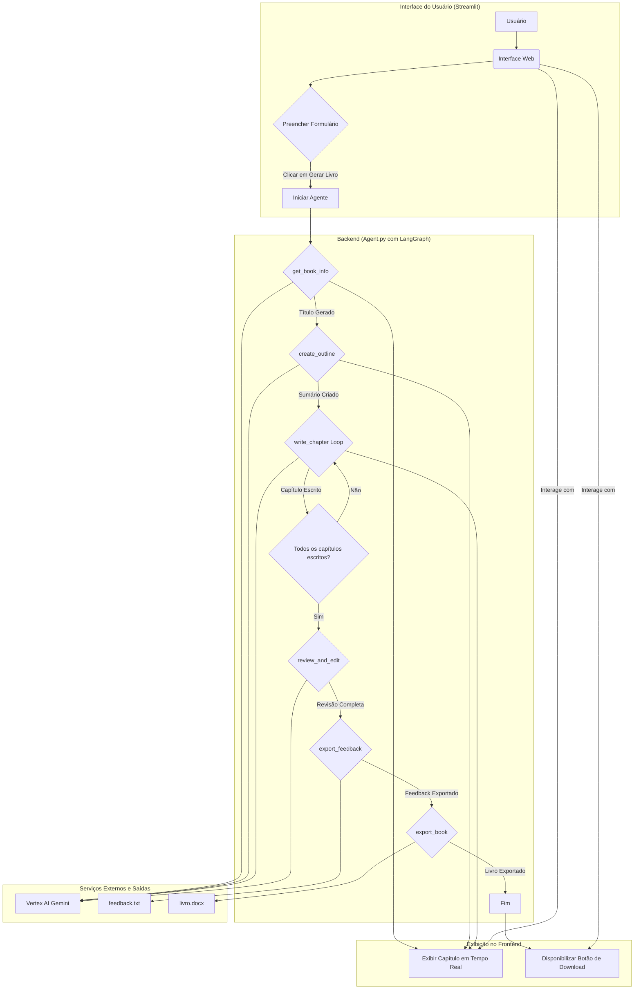
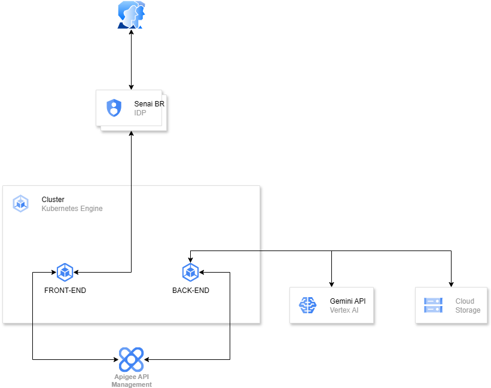

# Gerador de Livros com IA - Gemini e LangGraph

Este projeto implementa um agente de geração de livros que utiliza o modelo Gemini do Google (via Vertex AI) e a biblioteca LangGraph para automatizar o processo de criação de um livro, desde a concepção da ideia até a exportação do conteúdo final em formato DOCX. A interação com o usuário é feita através de uma interface web criada com Streamlit.

## Visão Geral

O agente de geração de livros é projetado para:

1.  **Coletar Informações via Interface Web:** Utiliza uma interface Streamlit para que o usuário forneça o tema, categoria, gênero, público-alvo e número de capítulos.
2.  **Gerar Título e Estrutura:** Cria um título técnico e um sumário detalhado com base nas informações fornecidas.
3.  **Escrever Capítulos:** Gera o conteúdo de cada capítulo de forma sequencial, mantendo a coerência e o estilo técnico.
4.  **Revisar e Gerar Feedback:** Realiza uma revisão completa do livro, fornecendo um feedback estruturado.
5.  **Exportar:** Exporta o livro completo e o feedback para arquivos DOCX e TXT, respectivamente, com formatação profissional (sumário, paginação, etc.).

## Tecnologias Utilizadas

*   **Python:** Linguagem de programação principal.
*   **Streamlit:** Para a criação da interface web interativa.
*   **LangGraph:** Para construir o fluxo de trabalho do agente como um grafo de estados.
*   **Google Vertex AI (Gemini):** Para a geração de todo o conteúdo textual.
*   **python-docx:** Para a criação e formatação de arquivos DOCX.
*   **dotenv:** Para o gerenciamento de variáveis de ambiente.
*   **logging:** Para a geração de logs de execução.

## Estrutura do Projeto

O projeto é dividido em dois arquivos principais:

*   **`main.py`:** Contém a interface do usuário (frontend) construída com Streamlit. É responsável por coletar os inputs do usuário, iniciar o processo de geração e exibir o progresso e os resultados.
*   **`agent.py`:** Contém toda a lógica do agente de geração de livros (backend). Define o grafo de estados com LangGraph e as funções para cada etapa do processo (gerar título, sumário, capítulos, revisão e exportação).

## Como Executar

### Pré-requisitos

1.  **Conta no Google Cloud:** É necessário ter uma conta no Google Cloud com o Vertex AI habilitado.
2.  **Autenticação:** Configure a autenticação do Google Cloud no seu ambiente. A forma mais simples é instalar o Google Cloud CLI e executar `gcloud auth application-default login`.
3.  **Variáveis de Ambiente:** Crie um arquivo `.env` na raiz do projeto com a seguinte variável, contendo o ID do seu projeto no Google Cloud:
    ```
    GOOGLE_CLOUD_PROJECT="seu-id-de-projeto-aqui"
    ```
4.  **Instalação de Dependências:** Instale as dependências do projeto usando o `pip`:
    ```bash
    pip install -r requirements.txt
    ```

### Execução

Para iniciar a aplicação web, execute o seguinte comando no seu terminal:

```bash
streamlit run main.py
```

Acesse o endereço local fornecido pelo Streamlit no seu navegador para utilizar a ferramenta.

### Logs

O projeto gera logs detalhados em um arquivo chamado `book_generation.log` e também exibe logs no console onde o Streamlit está sendo executado.

## Fluxo de Trabalho

O fluxo de trabalho do agente é orquestrado pelo LangGraph. As etapas são:

1.  `get_book_info`: Coleta informações básicas e gera o título.
2.  `create_outline`: Cria o sumário do livro.
3.  `write_chapter`: Escreve o conteúdo de cada capítulo em um loop.
4.  `review_and_edit`: Revisa o livro completo e gera um feedback.
5.  `export_feedback`: Salva o feedback em um arquivo `.txt`.
6.  `export_book`: Exporta o livro final para um arquivo `.docx`.

## Diagrama do Fluxo


```mermaid
graph TD
    subgraph "Interface do Usuário (Streamlit)"
        A[Usuário] --> B(Interface Web);
        B --> C{Preencher Formulário};
        C -- "Clicar em Gerar Livro" --> D[Iniciar Agente];
    end

    subgraph "Backend (Agent.py com LangGraph)"
        D --> E{get_book_info};
        E -- "Título Gerado" --> F{create_outline};
        F -- "Sumário Criado" --> G{write_chapter Loop};
        G -- "Capítulo Escrito" --> H{Todos os capítulos escritos?};
        H -- Sim --> I{review_and_edit};
        H -- Não --> G;
        I -- "Revisão Completa" --> J{export_feedback};
        J -- "Feedback Exportado" --> K{export_book};
        K -- "Livro Exportado" --> L[Fim];
    end

    subgraph "Serviços Externos e Saídas"
        E --> M[Vertex AI Gemini];
        F --> M;
        G --> M;
        I --> M;
        J --> N[feedback.txt];
        K --> O[livro.docx];
    end

    subgraph "Exibição no Frontend"
        E --> P[Exibir Título];
        F --> P[Exibir Sumário];
        G --> P[Exibir Capítulo em Tempo Real];
        L --> Q[Disponibilizar Botão de Download];
    end

    B -- "Interage com" --> P;
    B -- "Interage com" --> Q;
```

### Arquitetura



### Melhorias Futuras

*   **Edição Interativa**: Permitir que o usuário edite o conteúdo do livro durante o processo de geração.
*   **Múltiplos Formatos de Exportação**: Adicionar suporte para exportação em outros formatos, como PDF e EPUB.
*   **Integração com Outros Modelos**: Explorar a integração com outros modelos de linguagem para melhorar a qualidade do conteúdo gerado.
*   **Refinamento de Prompts**: Melhorar os prompts para obter respostas mais precisas e alinhadas com as expectativas.
*   **Tratamento de Erros**: Implementar um tratamento de erros mais robusto na interface.

### Contribuições

Contribuições são bem-vindas! Se você tiver sugestões de melhorias ou correções de bugs, sinta-se à vontade para abrir uma issue ou enviar um pull request.

### Licença

Este projeto está sob a licença MIT.